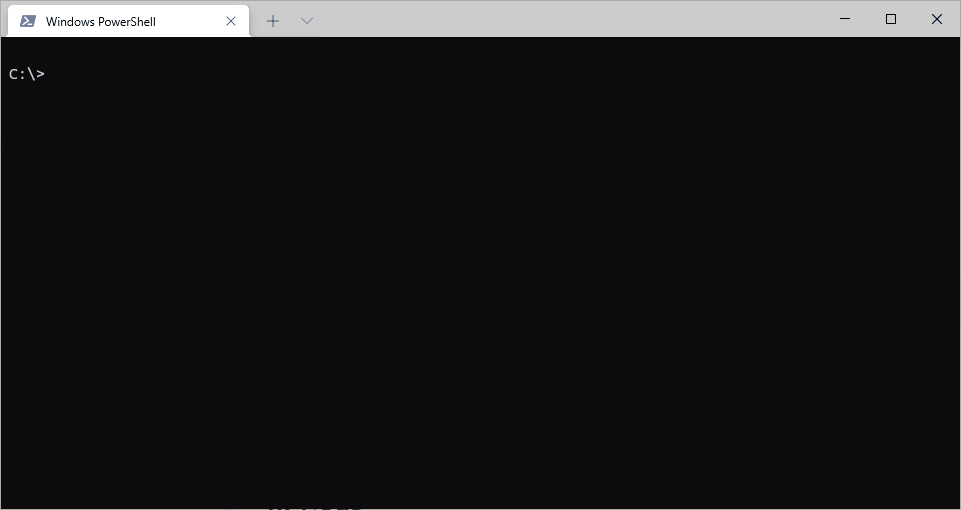
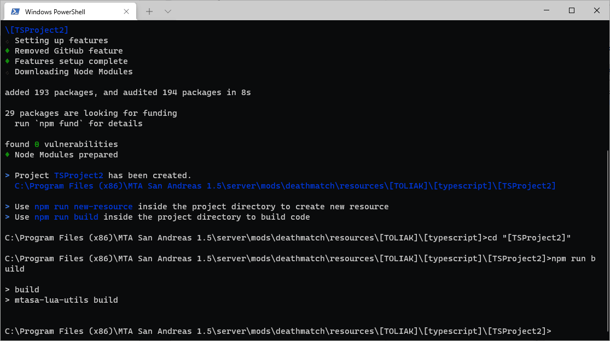
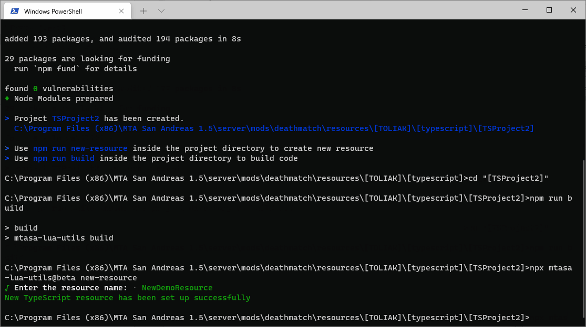

# MTASA Lua Utils for TypeScript compilation

Provides utilities for project creating, resource creating,



# Available commands

## Help

```
npx mtasa-lua-utils --help
```

## New Project

Create new project

```
npx mtasa-lua-utils new-project
```

## New Resource

Create new resource template

```
npx mtasa-lua-utils new-resource
```

**!** Run the command inside the project directory



## Build

Calls TypeScriptToLua functions for transpiling TypeScript resources

```
npx mtasa-lua-utils build
```

**!** Run the command inside the project directory


